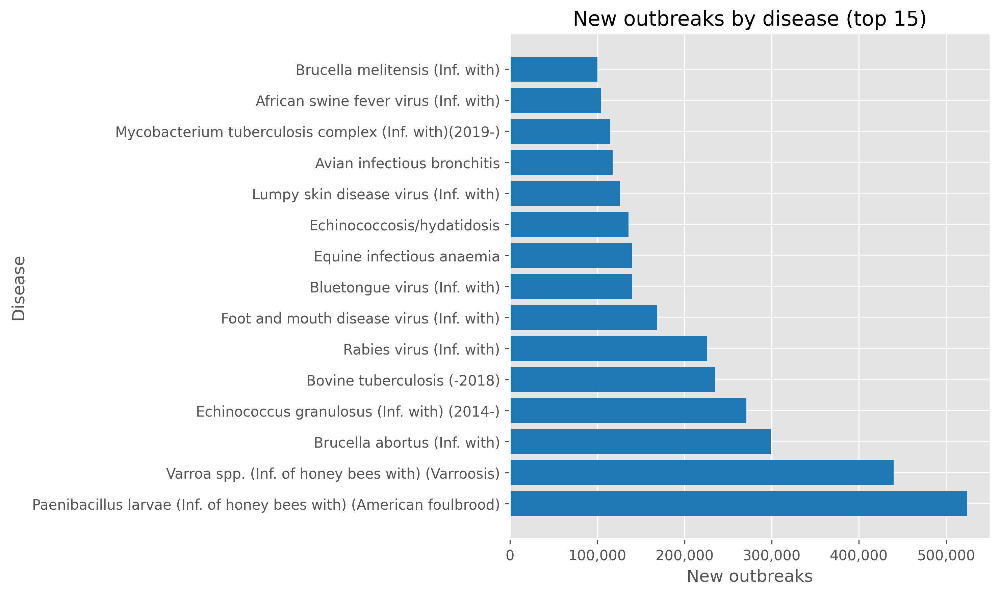
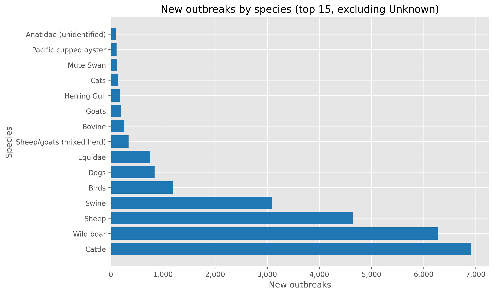

# WAHIS Outbreak Exploration

## Dataset Snapshot
- 569,062 outbreak records covering reporting years 2005-2025 (partial 2025)
- 201 reporting countries, 177 recorded diseases, 1,140 species designations
- 4,765,116 cumulative new outbreaks after replacing missing counts with zero

## Outbreaks by Country

The burden is highly concentrated: Iran reports 873,265 outbreaks, more than double the next country. China, Chile, Brazil, and Poland each exceed 190k events, suggesting either intense detection/reporting or genuine hotspots. Many other countries report comparatively few outbreaks.

## Outbreaks by Disease

Honey bee diseases dominate the top of the list. American foulbrood (Paenibacillus larvae) and Varroosis together account for nearly one million reported outbreaks, reflecting intensive apiculture surveillance. Zoonoses such as Brucellosis, Echinococcosis, and bovine tuberculosis also contribute substantial counts across multiple regions.

## Outbreaks by Species

The plotted bars exclude the "Unknown" category, but the summary table retains it and it still dominates with roughly 4.7 million outbreaks. Among identified hosts, cattle, wild boar, sheep, and swine remain prominent, underscoring that multi-host livestock diseases are a major concern.

## Outbreaks by Year

Outbreak counts peak around 2016 and remain elevated through 2022 before easing. The drop in 2025 likely reflects partial-year data rather than an abrupt improvement. The overall level hints at persistent, widespread reporting rather than isolated spikes.

## Outbreaks by World Region

Africa and Asia carry the highest aggregated outbreak totals, while the Americas also show substantial activity. Oceania and the residual "Other" grouping remain comparatively low, highlighting where monitoring resources are most heavily engaged.

## Notes
- Counts rely on the `New outbreaks` field; entries with missing values were treated as zero for aggregation.
- The dominance of "Unknown" species suggests further data cleaning or cross-referencing may be needed for species-level insights.
